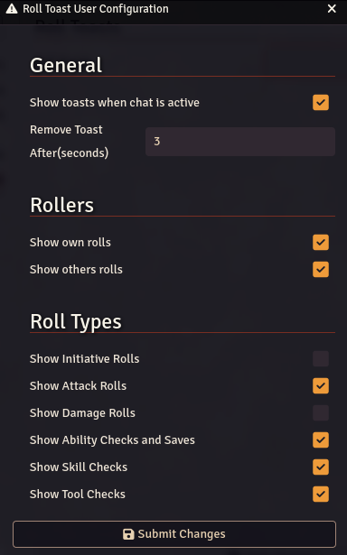

# Roll Toasts
Are you sick of switching to the chat log to see a roll result? I know I was!

Roll Toasts is a module for DnD 5E and P2FE Systems that allows the user to see rolls in a toast notification feed.
Each toast notification is a simple view of the character, roll type and result.

Setup is per user and allows you to filter what you want and don't want to see.

# Settings Reference
## General
 - **Show toasts when chat is active** - if ticked, the user will still see toasts when chat window is active.
 - **Remove Toast After(seconds)** - How many seconds till the toast automatically removes itself (empty will be 0 seconds)

## Rollers
 - **Show Own Rolls** - If you untick you won't see your own rolls.
 - **Show Others Rolls** - If you untick you won't see anyone else's rolls

## Roll Types
These settings will set what rolls you will see from your own or anyone else's rolls.
The options vary by system.